# 🧾 Billing Management System

A desktop-based **Billing Management System** built with **Java Swing** (UI), **JDBC** (database connectivity), and **MySQL** (backend). This application helps manage buyers, products, and generate bills efficiently.

---

## 📌 Features

- Add, update, delete buyers and products
- Search buyers/products by ID or name
- Generate and print customer bills (PDF)
- Store and retrieve billing history
- User-friendly GUI with Java Swing

---

## 🚀 Implementation

- **Java Swing**: All UI forms and dialogs are implemented using Swing.
- **JDBC**: Database operations (CRUD) are handled via JDBC.
- **MySQL**: Data for buyers, products, and bills is stored in MySQL tables.
- **PDF Generation**: Bills are exported as PDF files using `itext.jar`.
- **Table Models**: Data is displayed in tables using `rs2xml.jar`.

---

## 🖥️ GUI Pages

Below are screenshots of the main application pages:

### Login
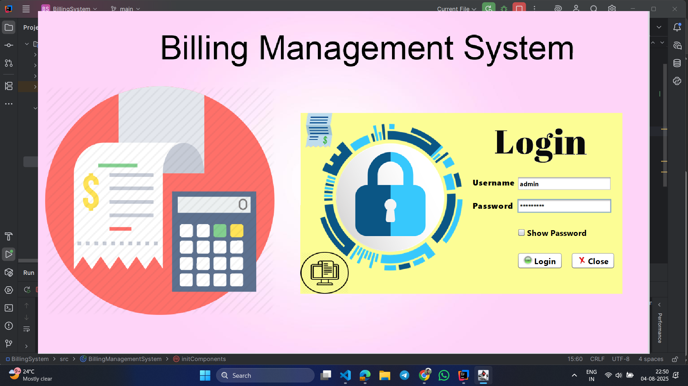

### Menu
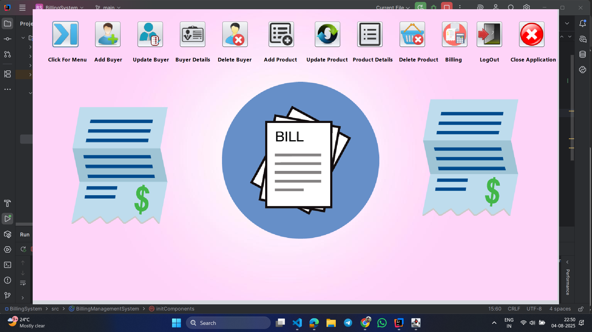

### Add Buyer
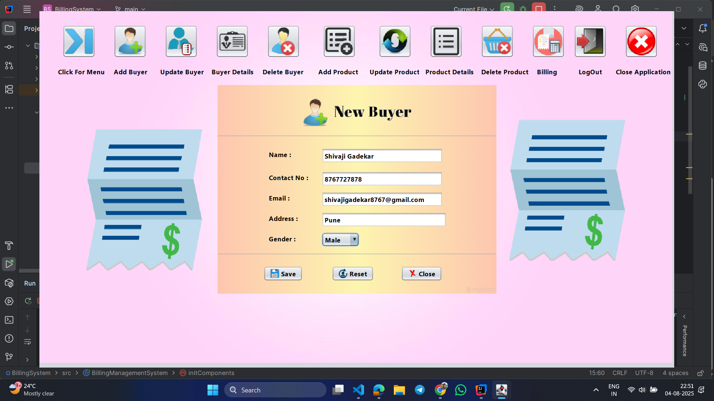

### Update Buyer
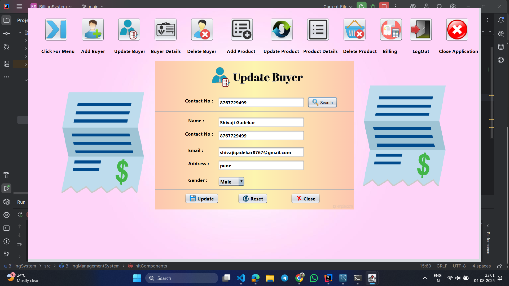

### Delete Buyer
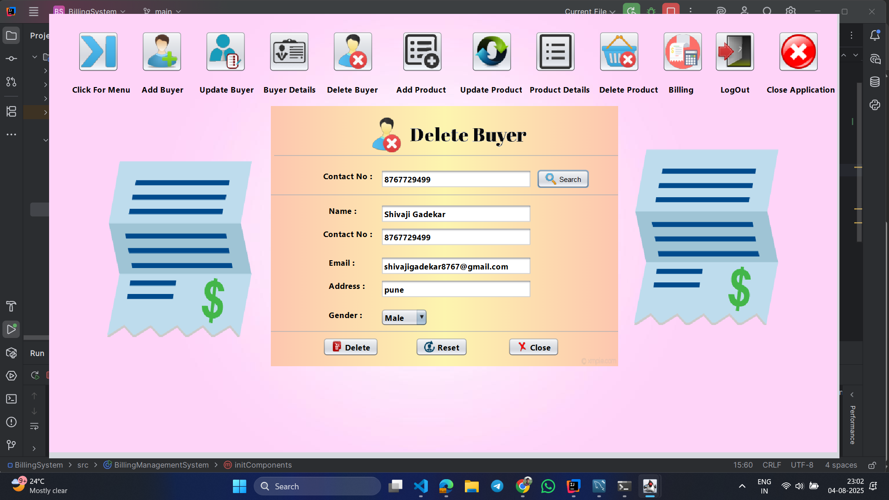

### Buyer Details
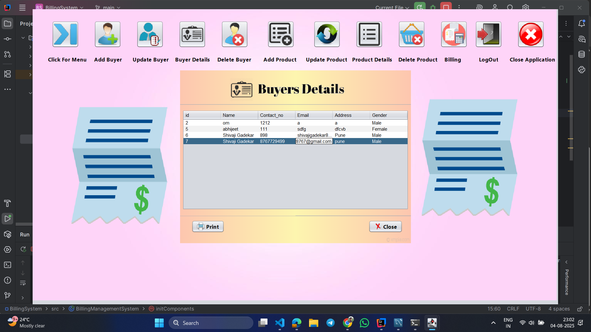

### Add Product
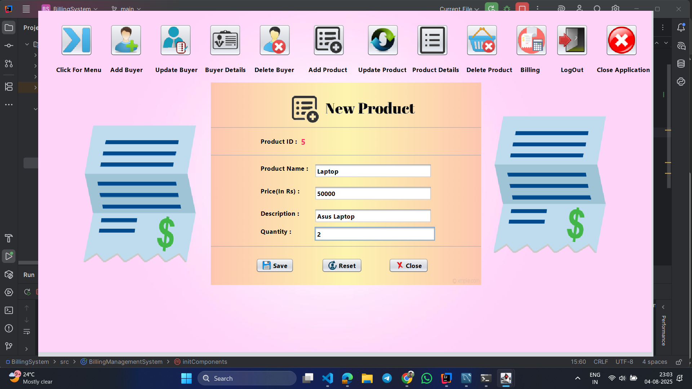

### Update Product
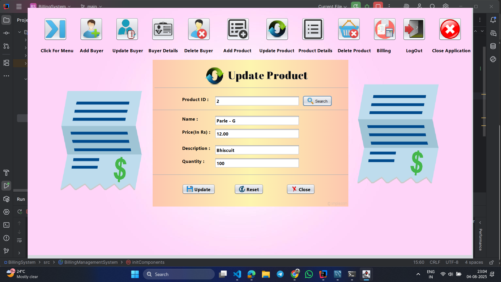

### Delete Product
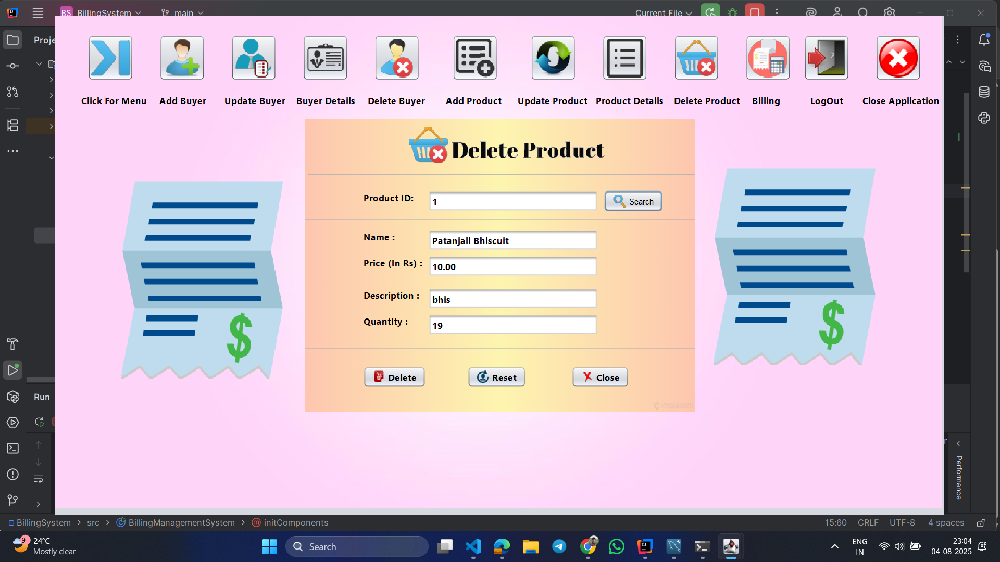

### Product Details
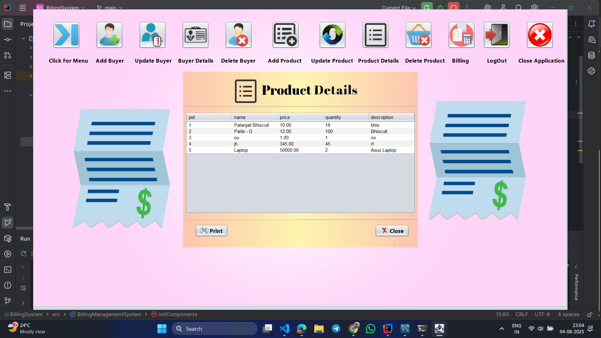

### Billing Page
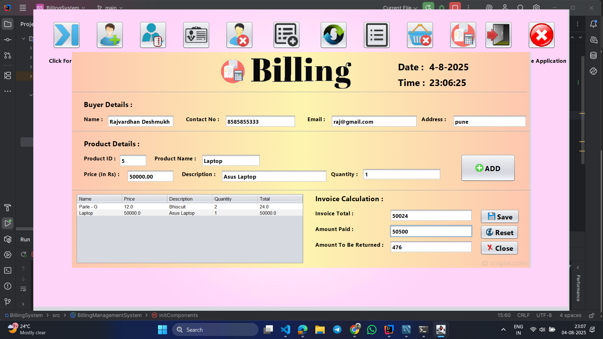
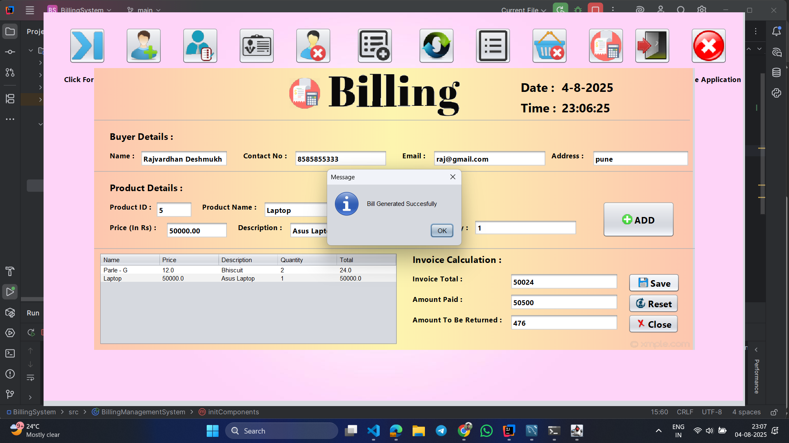


---
## 🧱 Database Schema

### 🔹 `buyer` Table

| Column Name | Data Type | Description         |
|-------------|-----------|---------------------|
| id          | INT (PK)  | Unique Buyer ID     |
| name        | VARCHAR   | Buyer's Name        |
| contact     | VARCHAR   | Phone Number        |
| email       | VARCHAR   | Email Address       |
| address     | VARCHAR   | Address             |
| gender      | VARCHAR   | Gender              |

### 🔹 `product` Table

| Column Name | Data Type | Description         |
|-------------|-----------|---------------------|
| id          | INT (PK)  | Unique Product ID   |
| name        | VARCHAR   | Product Name        |
| price       | DOUBLE    | Price per Unit      |
| quantity    | INT       | Available Stock     |
| description | TEXT      | Product Description |

### 🔹 `bills` Table

| Column Name  | Data Type | Description            |
|--------------|-----------|------------------------|
| buyer_id     | INT (FK)  | Linked Buyer ID        |
| product_id   | INT (FK)  | Linked Product ID      |
| P_quantity   | INT       | Total Product Quantity |

---

## 📦 Applications

- Retail shops for quick billing and inventory management
- Small businesses to track buyers and products
- Generating printable bills for customers
- Maintaining sales and billing history

---

## 💻 Setup Instructions

1. **Clone the Repository**
   ```bash
   git clone https://github.com/Shivagad/Billing-Management-System.git
   ```
2. **Configure MySQL Database**
   - Create the database and tables as per the schema above.
   - Update database credentials in the source code if needed.

3. **Run the Application**
   - Compile and run using your IDE (NetBeans, IntelliJ, VS Code).
   - Ensure `itext.jar` and `rs2xml.jar` are included in your classpath.

---

## 📂 Project Structure

```
Billing-Management-System/
│
├── Bill PDF/           # Generated bills (PDF)
├── Output/             # GUI screenshots
├── src/                # Source code (.java, .form)
├── itext.jar           # PDF generation library
├── rs2xml.jar          # Table model library
├── README.md           # Project documentation
└── ...
```

---

## 🙏 Credits

Developed by [Rajvardhan Deshmukh](https://github.com/raj-deshmukh6403).

---

## 📄 License

This project is licensed under the MIT License.